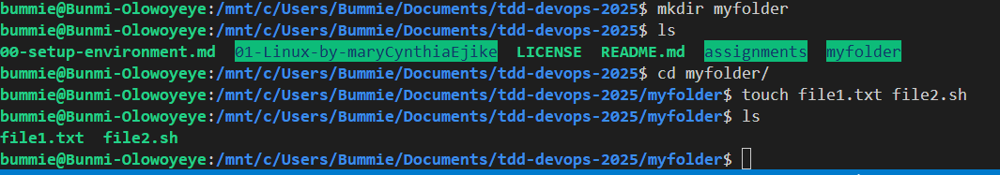

## Week 1 Assignment.
### Task 1 - Create user accounts with login access and home directory.

#### Created the first user account named "user1" with login access.

#### Created another user account named "user2" also with login access.

### Task 2 - Create a folder and two files with different permissions.

#### Created a folder named "myfolder" with two files inside.
A text file and a bash file.

#### Seeing file1 and file2 has all permission (read, write and execute) set by default, I decided to limit the files permissions.

#### Both files now has different permissions.

