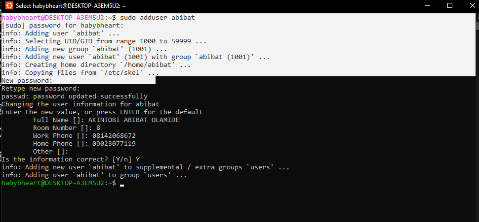
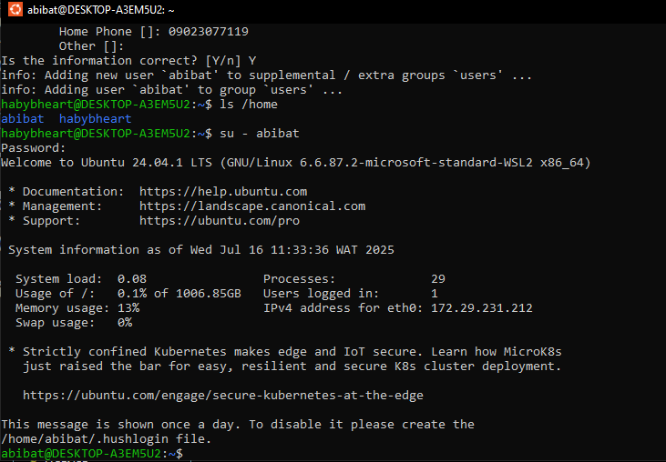
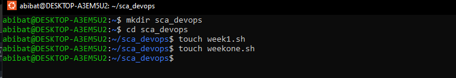
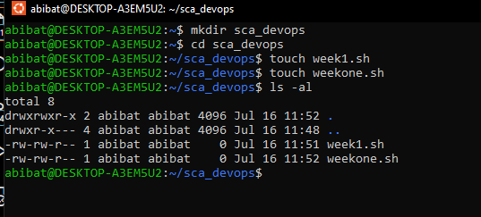
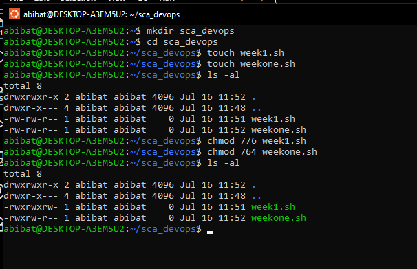

TASK A: Create user accounts with login access and home directory.

# **SOLUTION**

 Image to create a new user named "abibat"

TASK B: Create a folder and two files with different permissions.

# **SOLUTION**

1. image to switch to the new user
   

2. created 2 files names week1.sh and weekone.sh
   

3. shows the initial permission on the 2 files
   

4. 
   changed the permission of week1.sh to owner and group can read, write and execute while others can only read and write.

changed the permission of weekone.sh to owner: read, write and execute, group: read and write while others can only read.
