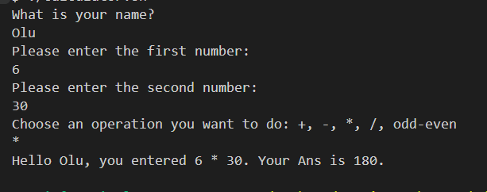

# Simple Bash Calculator

This project is a simple calculator implemented in **Bash**. It prompts the user to enter their name, two numbers, and an operation to perform. It supports basic arithmetic operations **addition, subtraction, multiplication, division** and also checks whether a number is **even or odd**.

---

## Features

✅ **User-friendly prompts**  
✅ Reads:
- User's name  
- Two numbers  
- Operation type  

✅ Supports operations:
- Addition (`+`)  
- Subtraction (`-`)  
- Multiplication (`*`)  
- Division (`/`)  
- Even/Odd check  

---

## How It Works

The script:

1. Greets the user by name.
2. Asks for two numbers.
3. Asks which operation to perform.
4. Performs the calculation and displays the result.
5. Also checks if the entered numbers are even or odd.

---

## Example Usage

> ### Addition Operation! 
>### Subtraction Operation!
>### Multiplication Operation!
>### Division Operation!
>### Checking Odd or Even!

